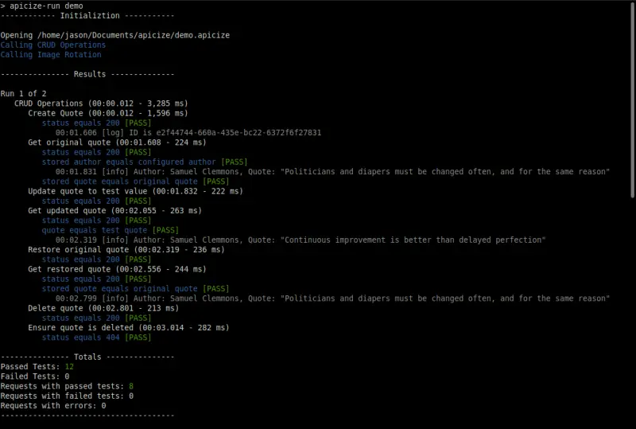

# Apicize

## Overview

Apicize is a testing platform that facilitates webservice testing both via GUI and CLI.  It utilizes Rust and V8 for file I/O and
to execute  HTTP requests and tests.  Tauri, React, MobX and MUI are used for the UI.  The Monaco editor is used to edit JSON and JavaScript.

### Contents

* [Installation](#installation)
* [Project Objectives](#project-objectives)
* [Usage](#usage)
* [Development](#development)
* [License and Attributions](#license-and-attributions)

## Installation

Download a binary from the [latest release](./releases/latest).

GUI installations are available for:
 
* Redhat based distributions (.rpm)
* Debian / Ubuntu based distributions (.deb)
* Windows (64 bit .msi)
* MacOS (.dmg / .tar.gz)

CLI installations are currently available for Debian and RedHat distributions [here](https://github.com/apicize/cli/releases/latest).

You can build for other operating systems (see [below](#development)).

When launching the GUI for the first time, it will load a workbook that demonstrates basic functionality.

## Project Objectives

### Testing as a *First-Class* Concept

You can create flexible BDD-style JavaScript tests that can optionally be grouped.  Checking for "200" status codes are only the beginning.  You can examine resopnse data and update scenario variables used for the next test in a group.  This lets you easily perform tasks like CRUD testing.


### Cross-Platform (Linux, Windows and Mac)

Apicize uses [Tauri](https://tauri.app/), [NextJS](https://nextjs.org/) and [React](https://react.dev/) to run on major desktop OSs.  

### CLI Version

Along with the user application, there is a CLI test runner (currently with Linux builds), writtin in Rust, designed to run as part of CI/CD workflows.  It uses the same exact files that are
created by the GUI.  You can easily generate configurations in your CI/CD images or pipelines containing credentials, certificates and proxies.



### Simple Data Interoperability

The Apicize file format is simple JSON, making it straightforward to integrate with other systems.

## Usage

## Apicize Terminology

The following are terms used in Apicize

* **Workbook**:  A file that contains Requests, optionally including Authorizations, Scenarios, Certificates and/or Proxies
* **Vault**:  A shared store of Authorizations, Scenarios, Certificates and/or Proxies
* **Workspace**:  An opened Workbook and Vault opened for editing and execution
* **Request**:  Information required to make a webservice call *and* evaluate its succesful completion.  Success may be defined as a 200 status, it may involve evaluating the response body, or it may be a negative test (i.e. you expect to get a 404 Not Found)
* **Authorization**:  Webservices often enforce authorization of the caller.  Currently supported authorizations include Basic Authentication, API Key Authentication, and OAuth2 Client Authentication
* **Scenario**:  A list of variables that can be substituted in a Request.  For example, you may have a set of calls that you want to test against different products.  Rather than having to create a copy of those requests, you can just execute the same tests against different scenarios.
* **Certificate**:  Client certificates used to establish identity.  These can be either PKCS or PEM format.
* **Proxy**: A SOCKS5 or HTTP proxy to route HTTP traffic
* **Test**: A block of JavaScript that either runs to completion (success) or throws an error (failure)

## Testing in Apicize

Tests in Apicize are designed to indicate a request call is successful.  By default, this test is created for you when defining a new request:

```js
describe('status', () => {
  it('equals 200', () => {
    expect(response.status).to.equal(200)
  })
})
```

This test simply indicates that you received a 200 response.  You can test for much more though...

The `expect` assertion is imported from the [Chai](https://www.chaijs.com/) library.

When authoring a test, the following global variables will be available for use in JavaScript:

* `scenario`:  A list of variables defined in the currently active Scenario (if any)
* `output`: A list of values output from previous requests in the group
* `data`:  When a data seed is defined, this will hold the values for the current data row
* `$`: A merged list of previously output variables, scenario variables, and data row variables.  These values, as defined, are used 
to populate handlebars values in the request URL, headers, body, etc.
* `request`: Properties describing an HTTP request
* `resposne`: Properties describe an HTTP response

After executing a request, you can view the response details and examine `dataContext` to see all 
variables available for use in your testing.

**request** properties include:

* `url` (including query string parameters)
* `method`
* `headers`
* `body`
  * `type`: Type of body data (JSON, XML, Form, Raw, Text)
  * `text`: UTF-8 text of response (when not raw/binary)
  * `data`: For JSON and XML data, this will be a JSON object of the data; for Form, it will be name-value pairs; 
for Raw, it will be a Base64 representation of the binary data

**response** properties include:

* `status`
* `status_text`
* `headers`
* `body`
* `auth_token_cached` (set to `true` if previously generated OAuth token was used)

To output a value for use a subsequent request in the group, call the `output` function with a
variable name and value.  The value must be JSON serializable (basically, any value but a 
JavaScript function or symbol)

```js
describe('response', () => {
    it('includes an ID', () => {
        const data = (response.body.type == BodyType.JSON)
            ? response.body.data
            : expect.fail('Response body is not JSON')

        const id = data.id
        expect(id).not.to.be.empty
        output('id', id)
        console.info(`ID is ${id}`)
    })
})

```

## Development

### Getting Started

To build Apicize, you'll need yarn and Rust (1.8 or greater)

On Linux, you will need to have the following dependencies installed to build:

* libssl-dev
* libglib2.0-dev 
* libpango1.0-dev
* libatk1.0-dev
* libgdk-pixbuf-2.0-dev
* libgtk-3-dev
* libjavascriptcoregtk-4.1-dev
* libwebkit2gtk-4.1-dev

The project uses [yarn](https://yarnpkg.com/migration/overview).  Yarn's workspace functionality works better for me than NPM's.

From the project directory, run `yarn` which will pull in all of the NodeJS dependencies.  Then run `yarn start` which will build and launch the Tauri app.

If you want to run the CLI, navigate to the `@apicize/@cli` directory and execute `cargo build` and then `cargo run (workbookFileName)`.  You can build the CLI by running `cargo build` or `cargo build --release`

### Project Organization

These are the components in this monorepo that comprise Apicize:

* [**app**](./@apicize/app/README.md): Tauri user application to interactively edit and execute tests
* [**@apicize/lib-typescript**](./@apicize/lib-typescript/README.md): TypeScript definitions for Apicize test workbook/workspace data structures
* [**@apicize/toolkit**](./@apicize/toolkit/README.md):  React/MobX UI component toolkit for view and editing Apicize workbooks

Ideally, you could reuse lib-typescript and toolkit to build things like a Visual Studio Code extension, a hosted solution to execute Apicize tests, etc. 
Eventually these projects will be broken off from this monorepo.

Supporting Rust projects include:

* [**lib-rust**](https://github.com/apicize/lib-rust): Rust crate for executing tests
* [**Apicize CLI**](https://github.com/apicize/cli): Rust CLI application to execute tests

### Building and Debugging

From the project's main directory, run `yarn start` to build and run the app using development configuration.  Run `yarn watch` do the same thing, but with
rebuild if the either the **lib-typescript** or **toolkit** are updated.  When using watch mode, you'll have to Ctrl-C in the terminal window to completely 
shut things down.

VSCode debugging launch configurations are included.

## License and Attributions

Apicize's applications, libraries and components are licensed under the [MIT](./LICENSE.md) license.  

Apicize would not be possible without the excellent work of the following projects:

* [Tauri](https://tauri.app/)
* [Rust](https://www.rust-lang.org/)
* [React](https://react.dev/)
* [Mobx](https://mobx.js.org/)
* [MUI](https://mui.com/)
* [V8](https://v8.dev/)
* Tons of other libraries, crates, etc. that hold it all together

Thanks to everybody.  It's amazing that all of this technology is available to freeloaders like me.
